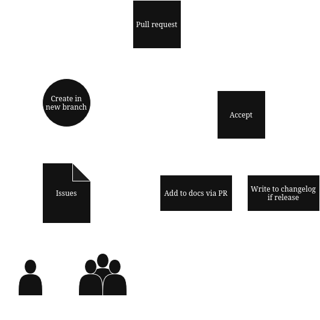

# General Workflow for developing UniOS or UniOS apps

This document explains the general workflow of how to develop for UniOS and the apps that support it. Generally we will touch the subject of developing the apps first because UniOS currently undergoes general development. 

## UniOS Apps 

In general all development and especially apps are developed via issues, the following diagram explains the workflow visually: 

    

Namely the steps can be reduced to:

- Issue is being created by the UniOS team or the individual 

- An individual or a team member creates a new branch and tries to solve the issue

- After submitting the pull request and after the reviews and adjustments the PR is accepted

- If the change is significant (marked by the significant tag in the issue page) the change should be documented in UniDocs and pushed through a PR. 

- If the change is bumping a version number, then a release should be created and a changelog should be generated. 

## UniOS 
UniOS is developed a bit differently, because packages are a bit more weird you do need to have access to the PPA team, which for now only two people have for safety reasons. 

Generally the package development cycle is the same with the apps development cycle, but when the PR passes and the build is completed the maintainers of the PPA will use `dput` to add the `.source` package to Canonical's servers.
