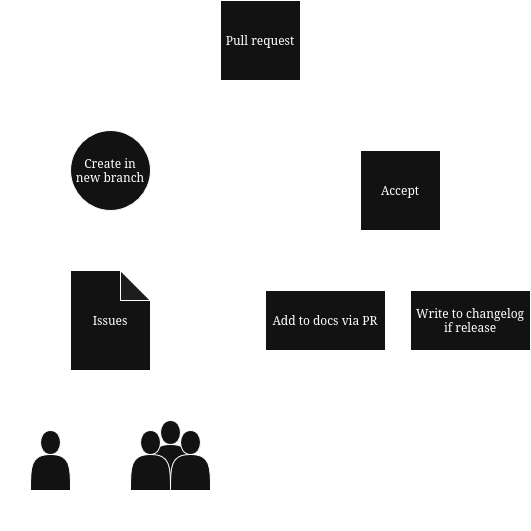

# General Workflow for developing UniOS or UniOS apps

This document explains the general workflow of how to develop for UniOS and the apps that support it. 

## Building process 
Because we want to build process to be as accessible to the core team without having to switch OS and developer's computer agnostic to avoid silly bugs we do maintain a server that builds the ISO and the packages, that server is `build.unios-project.eu`, it is accessible only through the core team members listed on our webpage, you can of course ask a maintainer to perform the build for you but in general the maintainers already know that if an issue is flagged with the `build.unios-project.eu` label it is to be built using the server. There is a dedicated article that details to building process on the server.

## UniOS Apps 

In general all development and especially apps are developed via issues, the following diagram explains the workflow visually: 

    

Namely the steps can be reduced to:

- Issue is being created by the UniOS team or the individual 

- An individual or a team member creates a new branch and tries to solve the issue

- After submitting the pull request and after the reviews and adjustments the PR is accepted

- If the change is significant (marked by the significant tag in the issue page) the change should be documented in UniDocs and pushed through a PR. 

- If the change is bumping a version number, then a release should be created and a changelog should be generated. 

### How to get help throughout the process
If you need to ask questions or need human support during the development process there are serveral ways to get it. Namely: 

- You can of course ask for help in the PR and a maintainer will get back to you as soon as possible. 

- You can hop on the engineering call every Thursday with the core team of the project. (Hours vary every Thursday because we are students)

- You can come and ask us in the office B-102 in University of Macedonia every Sunday. 

## UniOS 
Since UniOS is an Arch derivative it should be regulary updated, once every month we trigger an update and the ISO is being updated with the newest Arch packages and the newest UniOS packages. This date is set to be the 16th of every month. 

We use the same server aforementioned to build the ISO, but this job is automated so there is no need for a maintainer or a contributor to do anything

In general we don't trigger "emergency" updates for bugs that are encoutered but there is a way to patch a problem in the middle of the updates interval. You can ass your fix as a dependency in the `unios-applications-meta` package and it will be pushed as an upgrade.
